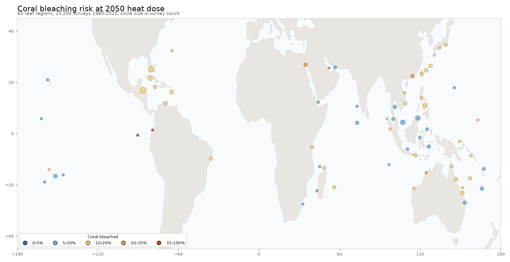

# Coral.Forest

Coral.Forest started as a 2018 Modern Regression course project: a random forest that flags coral reefs at risk of bleaching from Reef Check survey data. This repository keeps the original notebook and report, and adds a reproducible rebuild in R and Python with evaluation splits that test the model on ocean basins and years it has not seen.

| Path | Contents |
|---|---|
| `original/` | The 2018 R notebook and PDF report, unchanged |
| `data/` | The Reef Check extract used in 2018, with a [data sheet](data/README.md) |
| `R/reproduce_2018.R` | The 2018 cleaning and model call, runnable from the repository root |
| `coralforest/` | Python package: data loading, a port of the R forest, the evaluation harness |
| `results/` | Metrics written by the R script and by `python -m coralforest.evaluate` |
| `tests/` | pytest suite, including checks that the Python port agrees with R |

## Run it

Python 3.10 or later:

```bash
python -m venv .venv
.venv/bin/pip install -e ".[dev]"
.venv/bin/python -m coralforest.evaluate
.venv/bin/pytest -q
```

The evaluation takes about 40 seconds on a laptop and writes `results/scores.json` and `results/scores.md`.

R, with the `randomForest` package installed:

```bash
Rscript R/reproduce_2018.R
```

Set `REPEATS=20` to fit 20 forests with consecutive seeds and report the spread.

## The 2018 model

The response is `Bleaching` (yes or no). The eleven predictors are ocean basin, year, depth, recent storms, and seven human-stressor ratings (overall human impact, siltation, dynamite fishing, poison fishing, sewage, industrial pollution, commercial fishing). After cleaning, 9,111 surveys remain and 255 of them (2.8%) record bleaching.

The model is `randomForest(Bleaching ~ ., ntree = 500, mtry = 5, nodesize = sqrt(12), sampsize = c(300, 100))`. Each tree draws 300 surveys without bleaching and 100 with bleaching, so the trees see bleaching far more often than it occurs. The 2018 goal was to treat a missed bleaching event as three times as costly as a false alarm. Performance was read from the out-of-bag (OOB) votes.

## Python port

`coralforest/forest.py` ports the 2018 `randomForest` call to scikit-learn trees: per-class sampling of 300 and 100 surveys per tree, five candidate predictors per split, the same minimum node size, and out-of-bag voting. The trees split integer-coded factor levels on thresholds, whereas R splits a factor on any subset of its levels; the module docstring lists the other correspondences. `tests/test_forest.py` checks that the port's out-of-bag votes track the R rerun row by row.

## Evaluation

`python -m coralforest.evaluate` scores three models under five splits:

| Split | What it tests |
|---|---|
| `oob` | The 2018 method: each survey is scored by the trees that did not draw it |
| `random_5fold` | Stratified 5-fold cross-validation with shuffled rows |
| `leave_one_ocean_out` | Train on five ocean basins, test on the sixth (`Ocean` is dropped as a predictor) |
| `leave_one_year_out` | Hold out, one at a time, each year that has at least one bleaching record |
| `later_years` | Train on the years up to the last year with a bleaching record, test on all later years |

The models are `rf_2018` (the Python port with the 2018 settings), `rf_2018_noyear` (the same forest without `Year`) and `gbm` (scikit-learn's histogram gradient boosting on the same predictors, flagging a site when its predicted probability is 0.25 or more, which is the cost-minimising cut when a miss costs three false alarms).

The harness writes every score to `results/scores.json` and a summary table to `results/scores.md`. Both files are regenerated on each run and are not committed. Pass `--seed N` to check another seed.

## Global atlas (2026)

The 2018 model had no coordinates and no measure of heat, so it could only ask
which reefs bleach, not when. `coralforest/atlas/` answers the second question
from open data, and then asks what the answer means for the people and the
species around those reefs.



The page at [`docs/atlas.html`](docs/atlas.html) carries the same map with
every region's numbers, the fitted equation, and the sources.

### What it does

1. **Reads 23,204 reef surveys** from the global coral-bleaching
   database (1983-2019, CC BY 4.0), each with
   a position, a date, the share of coral bleached, and the heat dose that reef
   had taken, in degree heating weeks.
2. **Models one region in one year**, not one survey: 403
   region-years across 65 reef regions with at least ten
   surveys. The heat dose enters twice, as the region's long-run mean and as
   this year's difference from it, so a region that is always hot cannot pass
   for a region that got hot this year. The equations are fitted with the
   Bayesian causal layer of [EcoAnalyst](https://github.com/MikeHLee/EcoAnalyst).
3. **Adds each region's own trend.** The nearest NOAA Coral Reef Watch virtual
   station gives 41 years of daily heat dose; its annual maximum has risen
   +1.48 degree heating weeks per
   decade at the median station. That trend, carried to 2050, is the warming
   step in the scenario.
4. **Sends the benefits through the reef.** Each country's reef fishers, reef
   tourism value, and people shielded from flooding enter a small flow network
   whose reef node loses the share of coral that bleaches. What the reef loses
   is the benefit exposed to bleaching.

### What it finds

| | |
|---|---|
| Heat dose and bleaching, within a region | **+0.47** on the logit scale per degree heating week |
| Same, between regions | +0.18 |
| Median share of coral bleached | 6% today, **11%** at the 2050 heat dose |
| Skill against the mean, regions the fit never saw | +0.28 |
| Skill against the mean, years after 2010 with the fit stopping at 2010 | +0.40 |
| Same model with the year's heat dose removed | +0.23, and the rank correlation falls from 0.33 to 0.18 |

The last row is the control: knowing which region a reef is in explains a good
part of how much it bleaches, and knowing how hot that year was adds the rest.

At the 2050 heat dose, and treating every unit of benefit as coral-dependent,
the flow model puts **671,000 reef fishers** (71 countries, from 391,000
today), **4.47 billion US dollars a year of reef tourism** (62 countries, from
2.09 billion), and **24,000 people** whose flood exposure reefs lower (27
countries, from 13,000) behind impaired reef. Read those as exposure, not as
damage: the model says what sits behind the impaired share of a reef, not what
is lost, and it has no view on how fast a reef recovers.

### Run it

```bash
.venv/bin/pip install -e ".[atlas]"
.venv/bin/python -m coralforest.atlas.build
```

The first run downloads about 40 MB into `data/external/` (git-ignored) and
takes a few minutes; later runs read the cache. Outputs go to `results/atlas/`
(tables and a JSON summary), `figures/`, and `docs/atlas.html`.

### Limits

- Survey effort is uneven. Half the records come from one programme, and
  programmes differ in what they record, so the counts behind a region say more
  about who visits it than about how much reef is there.
- The heat dose in the survey records and the heat dose at a station are
  different products on different scales. They rank years alike (rank
  correlation 0.50), and the station trend is
  multiplied by 0.32 before it is used, but
  that bridge is a fitted line, not an identity.
- The 2050 step is each station's own straight-line trend since 1985. It is not
  a climate projection, and it carries no scenario of emissions.
- The community tables are published rankings, not full inventories. Beck 2018
  publishes 30 countries; Teh 2013 is one country short of its own total. Both
  gaps are recorded in [`data/community/README.md`](data/community/README.md).
- Bleaching is not death. The model measures the share of coral recorded as
  bleached, which is a measure of stress in that year.

## License

The code is licensed under the GNU General Public License v3.0 (see `LICENSE`). The survey data were collected by Reef Check; cite Reef Check when you use them.
